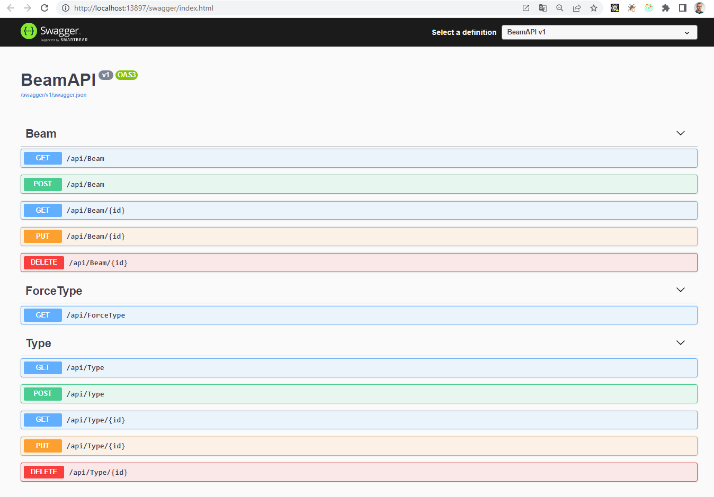
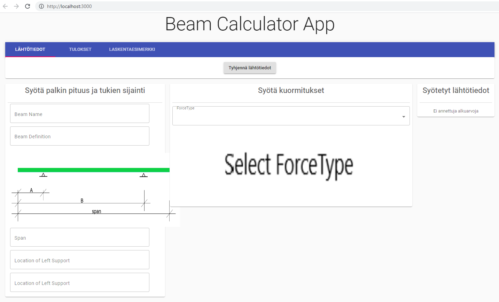

# Beam Calculator App

## Kuvaus ohjelmasta
Ohjelma piirtää 1-aukkoisen palkin taivutusmomentti- ja leikkausvoimakuviot
ja laskee voimasuureiden maksimit.
Palkissa voi olla päissä ulokkeet.
Kuormitustyypit ovat pistekuorma, pistemomentti, tasainen viivakuorma ja lineaarinen viivakuorma.
Samantyyppisiä kuormia voi olla max. 3 kpl. 

Lähtötietojen syöttö ja tulokset eriytetty eri sivustolle. 
Laskentaesimerkki-sivustolla löytyy ratkaistu laskentaesimerkki momentti- ja leikkausvoimakäyrineen.

## Asennus
Asenna koodi koneellesi. Avaa BeamAPI-kansio backend-koodi Visual Studiossa ja käynnistä. Käynnistyksen onnistuessa Swagger käynnistyy locachost-porttiin 13897.
Alkunäkymä:

Sen jälkeen avaa react-app-kansio Visual Studio Code:ssa ja kirjoita terminaalissa `npm start`. Käynnistyksen onnistuessa käynnistyy locachost-porttiin 3000. 
Alkunäkymä:

Huom! Jos käynnistys ei onnistu, varmista ensin onko localhost-portit oikein.

Copyright © Timo Kivelä