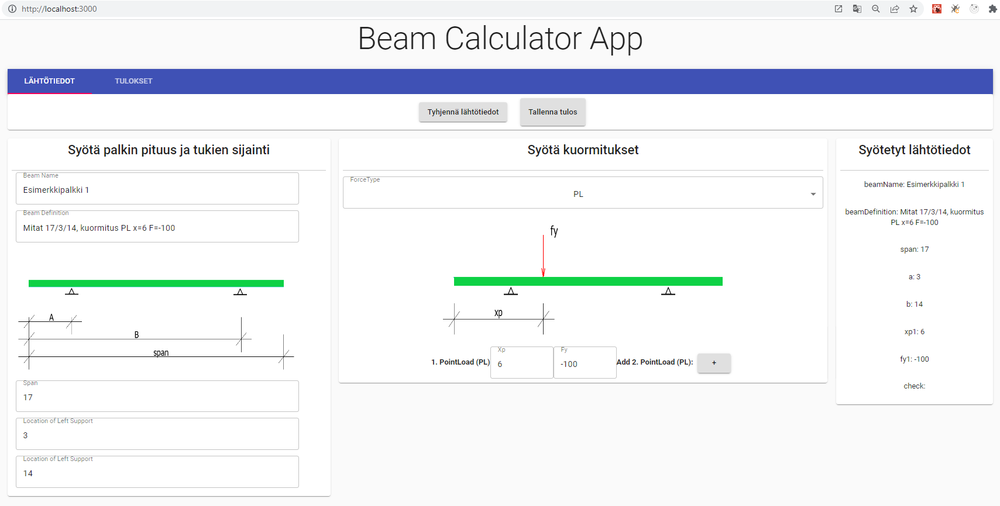
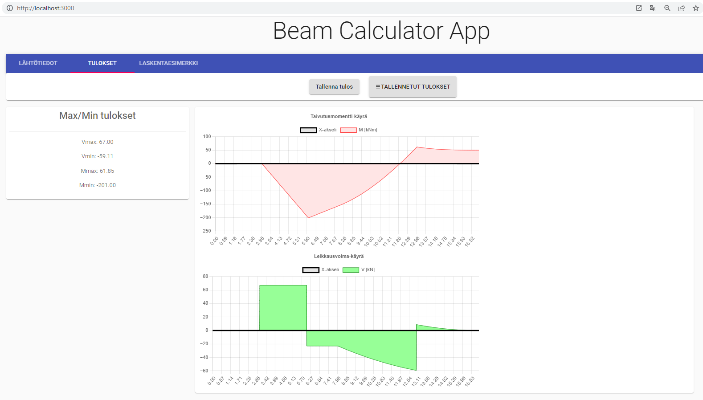
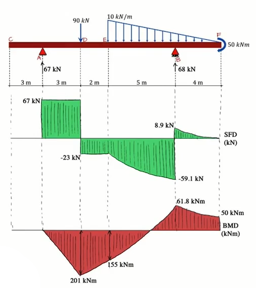

# Beam Calculator

## Kuvaus ohjelmasta
Ohjelma piirtää 1-aukkoisen palkin taivutusmomentti- ja leikkausvoimakuviot
ja laskee voimasuureiden maksimit.
Palkissa voi olla päissä ulokkeet.
Kuormitustyypit ovat pistekuorma, pistemomentti, tasainen viivakuorma ja lineaarinen viivakuorma.
Samantyyppisiä kuormia voi olla max. 3 kpl. 

Lähtötietojen syöttö ja tulokset eriytetty eri sivustolle. 
App.js sisältää vain Home.js. Home.js:ssä luodaan välilehdet.
Home.js sisällä on  
Tallennetut tulokset näkyvät popup-sivuna.
### Kuvia Layout:sta

## Käynnistys
Ohjelma käynnistyy terminaalissa komennolla `npm start`

## Ohjelmassa käytettyjä elementtejä
- React
- react-chartjs-2
- Hooks: useState, useEffect
- react-chartjs-2
- bootstrap
- material-ui

## Vinkkejä
`rfc` luodaan uusi functionaalinen komponentti

## Laskentaesimerkki

Copyright © Timo Kivelä