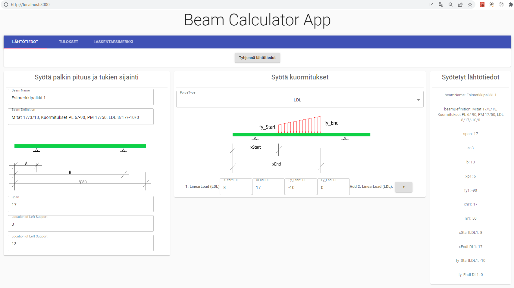
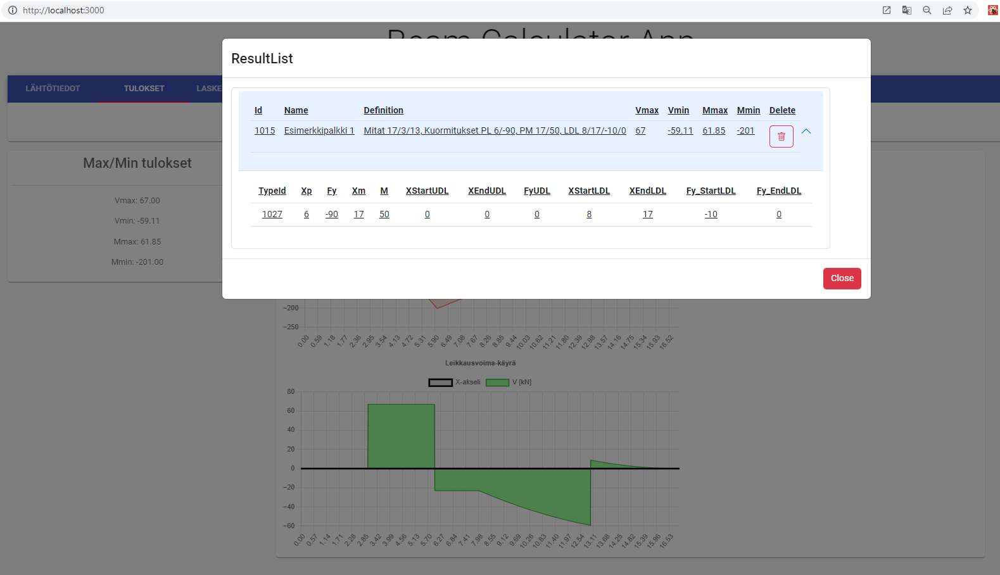

# Beam Calculator App

## Kuvaus ohjelmasta
Ohjelma piirtää 1-aukkoisen palkin taivutusmomentti- ja leikkausvoimakuviot
ja laskee voimasuureiden maksimit.
Palkissa voi olla päissä ulokkeet.
Kuormitustyypit ovat pistekuorma, pistemomentti, tasainen viivakuorma ja lineaarinen viivakuorma.
Samantyyppisiä kuormia voi olla max. 3 kpl. 

Lähtötietojen syöttö ja tulokset eriytetty eri sivustolle. 
App.js sisältää vain Home.js. Home.js:ssä luodaan välilehdet.
Home.js sisällä on Beam (lähtötiedot) ja Result (tulokset) sivut.
Lähtötiedot sivu on eriytetty neljään toimintalohkoon: Napit, palkin pituuden ja tukien syöttö, kuormitusten syöttö ja syötetyt lähtötiedot. 
Tulokset sivussa on Tallennetut tulokset-nappi, maksimitulokset, viivadiagrammi-lohkot.

### Kuvia Layout:sta ja laskennan kulku

Syötä palkin pituus ja tukien sijainnit. 
Kuormien syötössä valitse ensin kuormatyyppi (forceType) alasvetovalikosta ja anna kuormituksen arvot. Syötetyt arvot näkyvät oikeassa laidassa. 
Kun olet syöttänyt kaikki lähtötiedot, mene Tulokset-välilehdelle.

Paina Laske tulos-nappia. Saat tulokseksi Taivutusmomentti- ja Leikkausvoimakäyrät (viivadiagrammi) ja niiden maksimiarvot. 
Jos haluat tallentaa nämä tietokantaan, mene uudelleen Lähtötiedot-välilehdelle ja paina Tallenna tulos-nappia. 

Tallennetut tulokset saat näkyviin painamalla Tulokset-välilehden Tallennetut Tulokset-nappia. Tallennetut tulokset näkyvät popup-sivuna.

## Käynnistys
Käynnistä ensin backend ohjelma (BeamAPI) Visual Studio:ssa.
Frontend ohjelma (react-app) käynnistyy Visual Studio Code:ssa terminaalissa komennolla `npm start`.

## Ohjelmassa käytettyjä elementtejä
- React
- react-chartjs-2
- Hooks: useState, useEffect
- react-chartjs-2
- material-ui
- react-bootstrap

## Vinkkejä
`rfc` luodaan uusi functionaalinen komponenttipohja.

## Laskentaesimerkki

Kuvia Layout:sta ja laskennan kulku-kohdassa laskin tämän laskentatapauksen.

## Lisättäviä asioita
- Syötteiden tarkistus
- Syötteiden päivitys

Copyright © Timo Kivelä